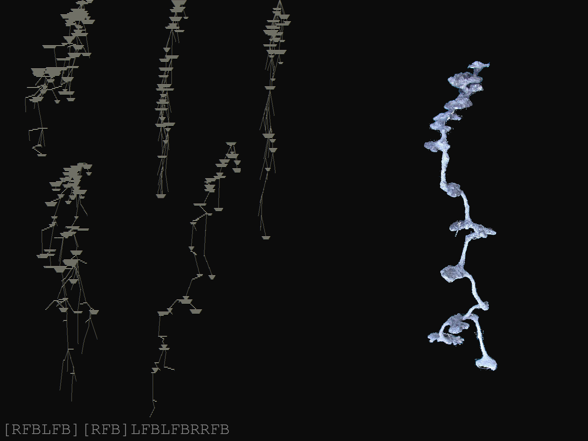
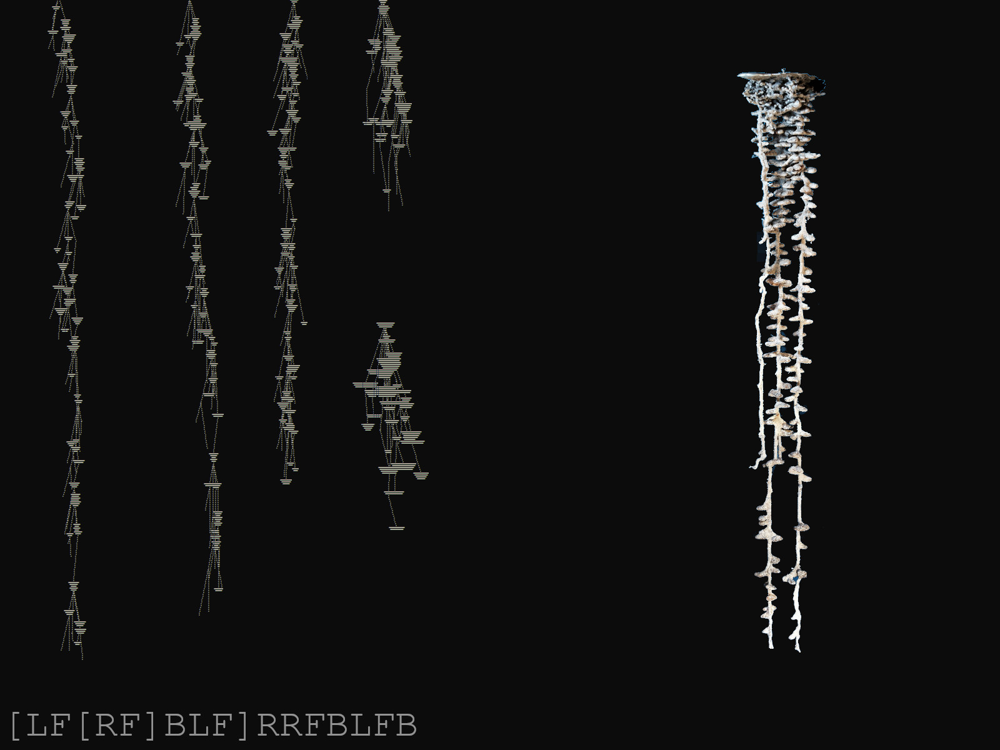

# L-System Encoding of Ant Nest Architecture

<p align="center">
  
  
</p>

# Description
This project attempts to model the structure of an ant nest (specifically fire some fire ant species) using an L-system and some additional parameters.

## Some variable info

| Variable  | Explanation |
| ------------- |:-------------:|
| MAX_LENGTH            | Defines the maximum length of shafts between chambers    |
| AXIOM_ITERATIONS      | How many times the rules of the L-system are applied.    |
| MAX_CHAMBER_SIZE      | Defines the maximum radius of each chamber.     |
| PROB                  | Probability of a chamber being built |
| PROB_DECAY            | The amount that the probability decreases after every iteration.

## L-system definitions, other things to know
```
L-system encodes these instructions:
L = rotate left by random angle underneath the surface
R = rotate right by random angle underneath the surface
F = move forward (from 0 to MAX_LENGTH) at present heading
[] =  save/load states
B = build a chamber based on probability

axiom : 'F'
rules : F->initial string

Misc:
1: probability of chamber building decreases as the depth increases
2: the interval of rotation reduces as probability of chamber building decreases
3: execution of L-system string ends when chamber building probability is below 10%
```
